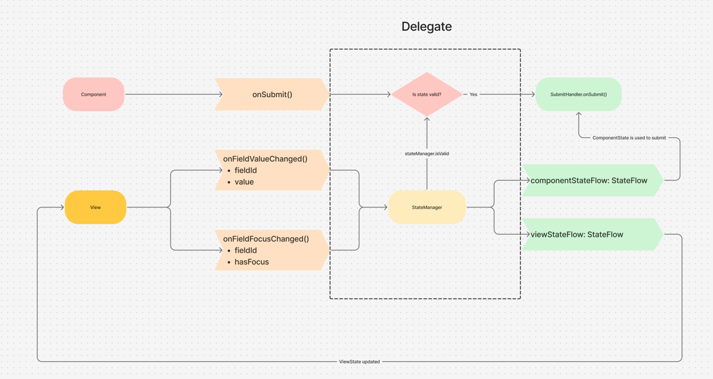
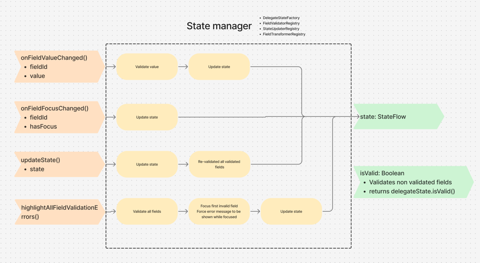

# Component state management

| Field         | Value        |
|---------------|--------------|
| Author(s)     | Oscar Spruit |
| Status        | Accepted     |
| Creation date | 2026-01-09   |

## Abstract

This ADR addresses the challenge of managing component state in a consistent and predictable way across all payment 
and action components in the SDK. After evaluating three different approaches (Delegate State Manager Pattern, 
Simplified State Manager, and MVI + Reducer Pattern), we chose the MVI + Reducer Pattern. This solution provides 
unidirectional data flow, pure reducer functions for testability, and declarative intents that explicitly document 
all possible state transitions.

## Motivation

Payment and action components in the SDK represent stateful UI views. The current implementation manages this state 
using a view model-like pattern where state is scattered across multiple state-holding fields. This approach has two 
key issues: state can become out of sync between different fields, and there is no clear source of truth.

Additionally, while this pattern is used across all components, it is not enforced in any way. This leads to 
inconsistent implementations between components and requires significant boilerplate code to set up. 

## Solutions

### Delegate State Manager Pattern

This solution introduces a centralized state management pattern where each delegate uses a `DelegateStateManager` 
to handle all state-related operations. The state manager maintains a single source of truth and exposes two 
separate flows: one for the component state (used for submission) and one for the view state (used for UI updates).

**Pros:**

- Single source of truth for state, eliminating sync issues between multiple state-holding fields
- Enforces a consistent pattern across all components
- Reduces boilerplate by providing reusable infrastructure in `components-core`
- Clear separation between component state (for API submission) and view state (for UI)
- Validation logic is centralized and testable via registries
- Focus management and error highlighting are handled automatically

**Cons:**

- Initial learning curve for developers unfamiliar with the pattern
- More abstractions to understand (registries, field IDs, etc.)
- To update fields we use generics, but because of Kotlin's type erasure it is possible to update a field with a
different type than the one it was initialized with. This would result in crashes at runtime.

### Simplified State Manager

This solution is an iteration of the Delegate State Manager Pattern that simplifies the architecture by removing 
the registry abstractions and addressing the type erasure issue. Instead of generic field updates with field IDs, 
each component defines type-safe update methods for its fields.

**Pros:**

- Single source of truth for state (same as Delegate State Manager Pattern)
- Enforces a consistent pattern across all components (same as Delegate State Manager Pattern)
- **Type-safe field updates** - No risk of runtime crashes from type mismatches
- Simpler architecture with fewer abstractions to understand
- Clear separation between `ViewState` (UI) and `ComponentState` (business logic)
- Validation logic is centralized in a single `ViewStateValidator` per component

**Cons:**

- Each component needs to define its own change listener interface with typed methods
- Slightly more boilerplate per component for defining field-specific update methods
- `ViewState` and `ComponentState` are two different sources and could again lead to synchronization issues.

### MVI + Reducer Pattern

This solution takes a different approach inspired by the MVI (Model-View-Intent) architecture pattern. Instead of 
imperative state updates, the UI dispatches **intents** (sealed classes representing user actions) that are processed 
by a **reducer** (pure function) to produce new state. This approach was adopted after recognizing limitations in the 
Simplified State Manager regarding state transition predictability and testability.

**Pros:**

- Single source of truth for state (same as previous solutions)
- **Unidirectional data flow** - Intent → Reducer → Validator → State → ViewState → UI
- **Pure reducer function** - All state transitions in one place, highly testable
- **Declarative intents** - Clear documentation of all possible user actions via sealed interface
- Automatic validation after every state reduction
- No ChangeListener interfaces needed - views dispatch intents directly
- Better separation of concerns between state transformation (reducer) and validation (validator)

**Cons:**

- More boilerplate for defining intent classes per component
- Slightly higher learning curve for developers unfamiliar with MVI/Redux patterns
- Indirect state updates may be harder to trace during debugging

## Final decision

**Chosen solution: MVI + Reducer Pattern**

We arrived at this decision through an iterative process, implementing each solution in sequence. At each stage, 
the chosen approach seemed like the best solution given our understanding at the time. Only after implementation 
did the shortcomings of the Delegate State Manager Pattern and Simplified State Manager become apparent.

The **Delegate State Manager Pattern** introduced a solid foundation with a single source of truth, but the use of 
generics and field IDs led to type erasure issues that could cause runtime crashes. The **Simplified State Manager** 
addressed the type safety concern but still relied on imperative state updates through change listener interfaces, 
making state transitions less predictable and harder to test in isolation. It again uses two separate states, 
`ViewState` and `ComponentState`, which could lead to synchronization issues.

The **MVI + Reducer Pattern** solves all our problems:

- **Unidirectional data flow** ensures state changes are predictable and easy to reason about
- **Pure reducer functions** make state transitions highly testable in isolation
- **Declarative intents** make it explicit how state can change, serving as documentation
- **Reusable infrastructure** in `core` module can be easily adopted by all components
- **Automatic validation** after every reduction ensures state is always valid

## Concerns and follow-up actions
There are no concerns or follow-up actions.

## Details

### Delegate State Manager Pattern

#### Architecture

The pattern consists of the following key components:

- **DelegateStateManager**: Central manager that holds the state and processes all state updates. It exposes:
    - `componentStateFlow`: Used to create the `ComponentState` for submission to the API
    - `viewStateFlow`: Used to update the UI with validation errors, focus states, etc.

- **DelegateState**: Component-specific state class containing all field states (e.g., `MBWayDelegateState`)

- **ComponentFieldDelegateState**: Represents the state of a single input field, containing:
    - `value`: The current field value
    - `validation`: The validation result (valid/invalid)
    - `hasFocus`: Whether the field currently has focus
    - `shouldHighlightValidationError`: Whether to show validation errors

- **UIEventDelegate**: Interface implemented by delegates to receive UI events from views:
    - `onFieldValueChanged(fieldId, value)`: Called when a field value changes
    - `onFieldFocusChanged(fieldId, hasFocus)`: Called when field focus changes

- **Registries**: Pluggable components for field-specific logic:
    - `FieldValidatorRegistry`: Validates field values
    - `StateUpdaterRegistry`: Gets/updates field state within the delegate state
    - `FieldTransformerRegistry`: Transforms field values before validation

#### Flow

1. **View** sends events to the delegate via `onFieldValueChanged()` and `onFieldFocusChanged()`
2. **Delegate** forwards these to the **StateManager**
3. **StateManager** validates the input using the validator registry and updates the state
4. **StateManager** emits updated state via `componentStateFlow` and `viewStateFlow`
5. **View** observes `viewStateFlow` and updates the UI accordingly
6. On **submit**, the delegate checks `stateManager.isValid`:
    - If valid: calls `SubmitHandler.onSubmit()` with the current `ComponentState`
    - If invalid: calls `stateManager.highlightAllFieldValidationErrors()` to show errors

### Simplified State Manager

#### Architecture

The pattern consists of the following key components:

- **StateManager**: Central manager that holds both view state and component state. It exposes:
    - `viewState: StateFlow<V>` - Used to update the UI with field values, validation errors, focus states, etc.
    - `isValid: Boolean` - Whether the current state is valid for submission

- **ViewState**: Component-specific UI state class containing all field states (e.g., `CardViewState`). Each field 
  uses a `TextInputState` or similar structure containing:
    - `text`: The current field value
    - `errorMessage`: The validation error (if any)
    - `showError`: Whether to display the error
    - `isFocused`: Whether the field currently has focus

- **ComponentState**: Component-specific business logic state (e.g., `CardComponentState`) containing configuration 
  that affects validation, such as `enableLuhnCheck`

- **ViewStateValidator**: Single validator class per component that handles:
    - `validate(viewState, componentState)`: Validates and returns updated view state with errors
    - `isValid(viewState)`: Checks if the state is valid for submission
    - `highlightAllValidationErrors(viewState)`: Shows all validation errors on submit

- **ComponentStateFactory** / **ViewStateFactory**: Create default states for initialization

- **ChangeListener**: Component-specific interface with typed methods for field updates (e.g., `CardChangeListener` 
  with `onCardNumberChanged(newCardNumber: String)`)

#### Flow

1. **View** calls typed methods on the change listener (e.g., `onCardNumberChanged("4111...")`)
2. **Component** calls `stateManager.updateViewStateAndValidate { copy(cardNumber = ...) }`
3. **StateManager** applies the update and calls `ViewStateValidator.validate()` to get validation errors
4. **StateManager** emits updated `ViewState` via `viewState` flow
5. **View** observes `viewState` and updates the UI accordingly
6. On **submit**, the component checks `stateManager.isValid`:
    - If valid: creates `PaymentComponentState` and emits submission event
    - If invalid: calls `stateManager.highlightAllValidationErrors()` to show errors

### MVI + Reducer Pattern

#### Architecture

The pattern consists of the following key components:

- **ComponentStateIntent**: Sealed interface representing all possible user actions for a component 
  (e.g., `MBWayIntent.UpdatePhoneNumber(number)`, `MBWayIntent.HighlightValidationErrors`)

- **ComponentState**: Component-specific state class containing all field data and UI state 
  (e.g., `MBWayComponentState` with `phoneNumber: TextInputComponentState`, `isLoading: Boolean`)

- **ComponentStateReducer**: Pure function that takes current state and an intent, returns new state:
    - `reduce(state: C, intent: I): C`
    - Handles all intents in a `when` expression
    - No side effects - only produces new state

- **ComponentStateValidator**: Validates state after reduction:
    - `validate(state: C): C` - Returns state with validation errors populated
    - `isValid(state: C): Boolean` - Checks if state is valid for submission

- **ComponentStateFlow**: Custom `StateFlow` implementation that orchestrates the flow:
    - Receives intents via `handleIntent(intent)`
    - Pipes intent through reducer, then validator
    - Emits validated state to observers

- **ViewState**: UI-specific state class (e.g., `MBWayViewState`) optimized for rendering

- **ViewStateProducer**: Transforms `ComponentState` to `ViewState`:
    - `produce(state: C): V`
    - Handles mapping between internal state representation and UI state

- **ComponentStateFactory**: Creates initial state for the component

#### Flow

1. **View** dispatches an intent (e.g., `onIntent(MBWayIntent.UpdatePhoneNumber("123456789"))`)
2. **ComponentStateFlow** receives the intent via `handleIntent()`
3. **Reducer** processes the intent: `reduce(currentState, intent)` → new state
4. **Validator** validates the reduced state: `validate(newState)` → validated state
5. **ComponentStateFlow** emits the validated state
6. **ViewStateProducer** transforms `ComponentState` to `ViewState`
7. **View** observes `viewState` and updates the UI accordingly
8. On **submit**, the component checks `validator.isValid(componentState.value)`:
    - If valid: creates `PaymentComponentState` and emits submission event
    - If invalid: dispatches `HighlightValidationErrors` intent
