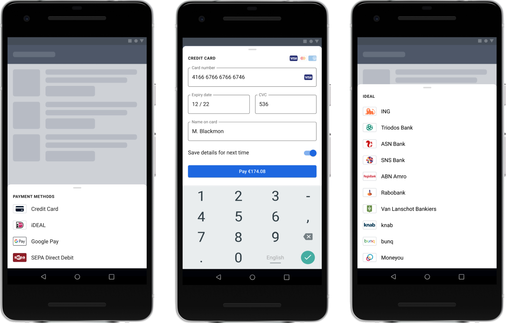

# Adyen Components for Android

Adyen Components for Android allows you to accept in-app payments by providing you with the building blocks you need to create a checkout experience.

For an overview of how you can integrate with Adyen on Android check out the [Documentation Website][docs.android]

<br/>



<br/>

## Support

If you have a feature request, or spotted a bug or a technical problem, create a GitHub issue. For other questions, contact our [support team][adyen.support].

## Installation

The Components are available through [Maven Central][dl], you only need to add the Gradle dependency.

### Migrate from v3

If you are upgrading from 3.x.x to a current release, check out our [migration guide][migration.guide].

### Import with Gradle

Import the Component module for the Payment Method you want to use by adding it to your `build.gradle` file.
For example, for the Drop-in solution you should add:
```groovy
implementation "com.adyen.checkout:drop-in:4.7.1"
```
For a Credit Card component you should add:
```groovy
implementation "com.adyen.checkout:card:4.7.1"
```

### Client Key

Drop-in and Components require a [client key][client.key], that should be provided in the `Configuration.Builder` constructors.

## Drop-in

The Drop-in is the implementation that handles the presentation of all available payment methods and the subsequent entry of a customer's payment details. It is initialized with the response of [`/paymentMethods`][apiExplorer.paymentMethods], and provides everything you need to make an API call to [`/payments`][apiExplorer.payments] and [`/payments/details`][apiExplorer.paymentsDetails].

### Usage

The Drop-in requires the response of the `/paymentMethods` endpoint to be initialized. To pass the response to Drop-in, decode the response to the `PaymentMethodsApiResponse` class.

You can provide the raw JSONObject to the `SERIALIZER` object to deserialize the data.
```kotlin
val paymentMethodsApiResponse = PaymentMethodsApiResponse.SERIALIZER.deserialize(jsonObject)
```

The Drop-in relies on you to implement the calls to your server.
When calling [`/payments`][apiExplorer.payments] or [`/payments/details`][apiExplorer.paymentsDetails] is required, it will trigger an intent to the `DropInService` which you need to extend.
The data comes as a `JSONObject` that you can use to compose your final `/payments` call on your back end.
After the call, you return a `DropInServiceResult` with a certain type, each type expects different parameters.
- `DropInServiceResult.Action` - If the result contains an `action` object, return it in the `actionJSON` param to continue the payment flow.
- `DropInServiceResult.Finished` - If there is no `action` the payment flow is finished, the `result` will be passed along.
- `DropInServiceResult.Error` - If an error happened during the connection.
 
```kotlin
class YourDropInService : DropInService() {
   // Submitting a payment request
   override fun makePaymentsCall(paymentComponentJson: JSONObject): DropInServiceResult {
       // Your server should make a /payments call containing the `paymentComponentJson`
       // Create the `DropInServiceResult` based on the /payments response
       return DropInServiceResult.Action("action JSON object")
   }
   // Submitting additional payment details
   override fun makeDetailsCall(actionComponentJson: JSONObject): DropInServiceResult {
       // Your server should make a /payments/details call containing the `actionComponentJson`
       // Create the `DropInServiceResult` based on the /payments/details response
       return DropInServiceResult.Finished("Authorised")
   }
}
```

Don't forget to also add the service your manifest.
```xml
<service android:name=".YourDropInService"/>
```

Configure Drop-in:

```kotlin
// Optional, if you want to display the amount and currency. In this example, the Pay button will display 10 EUR.
val amount = Amount().apply {
    currency = "EUR"
    value = 10_00
}

val dropInConfiguration = DropInConfiguration.Builder(YourContext, YourDropInService::class.java, "YOUR_CLIENT_KEY")
    .setAmount(amount)
    .setShopperLocale(shopperLocale)
    .build()
```

Optional - Configure specific payment methods:

```kotlin
val cardConfiguration = CardConfiguration.Builder(YourContext, "YOUR_CLIENT_KEY")
    .build()

val dropInConfiguration = DropInConfiguration.Builder(YourContext, YourDropInService::class.java, "YOUR_CLIENT_KEY")
    // ...
    .addCardConfiguration(cardConfiguration)
    .build()
```

You can find an example on how to create the `cardConfiguration` in the [Components](#components) section.

After serializing the payment methods and creating the configuration, the Drop-in is ready to be initialized. Just call the `DropIn.startPayment()` method. Optionally, you can pass a `resultIntent` to be launched after Drop-in finishes (for example, a `ResultActivity`).

```kotlin
//Optional. In this example, ResultActivity will be launched after Drop-in finishes
val resultIntent = Intent(YourContext, ResultActivity::class.java)

DropIn.startPayment(YourContext, paymentMethodsApiResponse, dropInConfiguration, resultIntent)
```

To handle the Drop-in result, call `DropIn.handleActivityResult` inside `onActivityResult` within the activity that initiated the payment (`DropIn.startPayment`). The result is obtained in the `DropInResult` wrapper class:

```kotlin
class CheckoutActivity : Activity() {
    override fun onActivityResult(requestCode: Int, resultCode: Int, data: Intent?) {
        super.onActivityResult(requestCode, resultCode, data)
        val dropInResult = DropIn.handleActivityResult(requestCode, resultCode, data) ?: return
        when (dropInResult) {
            is DropInResult.Finished -> handleFinished(dropInResult.result) // will not be called if a resultIntent was passed to DropIn.startPayment
            is DropInResult.Error -> handleError(dropInResult.reason)
            is DropInResult.CancelledByUser -> handleCancelled()
        }
    }
}
```

Additionally, if you specified a `resultIntent` when calling `DropIn.startPayment`, simply call `DropIn.getDropInResultFromIntent` inside  `onCreate` within the newly launched activity:

```kotlin
class ResultActivity : Activity() {
    override fun onCreate(savedInstanceState: Bundle?) {
        super.onCreate(savedInstanceState)
        val result = DropIn.getDropInResultFromIntent(intent)
    }
}
```

## Components

In order to have more flexibility over the checkout flow, you can use our Components to present each payment method individually in your own Activity.

To do that you need the data of that specific payment method parsed to the `PaymentMethod` class, and to create the configuration object (check out the [docs][docs.cardConfiguration] for a more detailed guide on how to initialize the `CardConfiguration.Builder`).

```kotlin
val cardConfiguration = CardConfiguration.Builder(context, "YOUR_CLIENT_KEY") .build()

val cardComponent = CardComponent.PROVIDER.get(this@YourActivity, paymentMethod, cardConfiguration)
```

Then you need to add the Component View to your layout.
```xml
<com.adyen.checkout.card.CardView 
        android:id="@+id/cardView"
        android:layout_width="wrap_content" 
        android:layout_height="wrap_content"/>
```

Then, after the component is initialized, you can attach it to the view to start getting user data.
```kotlin
cardView.attach(cardComponent, this@YourActivity)
```

From this moment you will start receiving updates when the user inputs data. When the data is valid, you can send it to the `/payments` endpoint.
```kotlin
cardComponent.observe(this) { paymentComponentState ->
   if (paymentComponentState?.isValid == true) {
      // When the shopper proceeds to pay, pass the `paymentComponentState.data` to your server to send a /payments request
      sendPayment(paymentComponentState.data)
   }
}
```

## ProGuard

If you use ProGuard or R8, you do not need to manually add any rules, as they are automatically embedded in the artifacts.
Please let us know if you find any issues.

## See also

* [Android Documentation][docs.android]

* [Adyen Checkout Documentation][docs.checkout]

* [API Reference](https://docs.adyen.com/online-payments/api-only/)

## License

This repository is open source and available under the MIT license. For more information, see the LICENSE file.

[docs.checkout]: https://docs.adyen.com/online-payments/
[docs.android]: https://docs.adyen.com/online-payments/android/
[dl]: https://repo1.maven.org/maven2/com/adyen/checkout/
[apiExplorer.paymentMethods]: https://docs.adyen.com/api-explorer/#/CheckoutService/v67/post/paymentMethods
[apiExplorer.payments]: https://docs.adyen.com/api-explorer/#/CheckoutService/v67/post/payments
[apiExplorer.paymentsDetails]: https://docs.adyen.com/api-explorer/#/CheckoutService/v67/post/payments/details
[adyen.support]: https://support.adyen.com/hc/en-us/requests/new?ticket_form_id=360000705420
[docs.cardConfiguration]: https://docs.adyen.com/online-payments/android/components#step-1-set-up-components
[client.key]: https://docs.adyen.com/online-payments/android/drop-in#client-key
[migration.guide]: https://docs.adyen.com/online-payments/android/migrate-to-android-4-0-0
